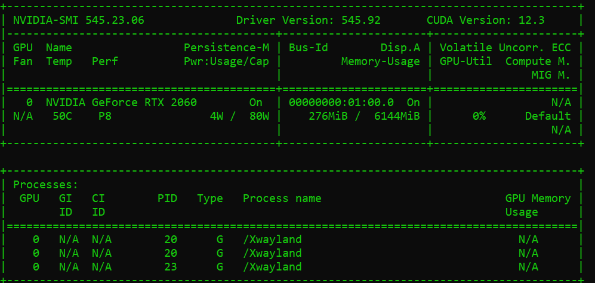

# Airgapped Copilot Project

## What didn't work

- Tried Docker images of refactAI, tabby and localAI (with GPU mode) directly on CMD, not on WSL.  All failed with: "nvidia-container-cli: initialization error: WSL environment detected but no adapters were found: unknown."

- RefactAI says this on the docs: "Install Docker with NVidia GPU support. On Windows you need to install WSL 2 first"


## Steps that worked
1. [Install latest NVIDIA drivers](https://developer.nvidia.com/cuda/wsl)
1. [Install Ubuntu on WSL2](https://ubuntu.com/tutorials/install-ubuntu-on-wsl2-on-windows-11-with-gui-support#3-download-ubuntu)
1. [Enable Docker integration with locally installed WSL 2 Distros](https://docs.docker.com/desktop/wsl/#prerequisites)
1. [Install Docker Support for NVIDIA](https://docs.nvidia.com/ai-enterprise/deployment-guide-vmware/0.1.0/docker.html)
1. Test with: 
    ```
    sudo docker run --rm --gpus all nvidia/cuda:11.0.3-base-ubuntu20.04 nvidia-smi
    ```
    It should display GPU info: 
    
1. Then, inside WSL/Ubuntu terminal, run the docker one-liners of refactAI & Tabby.  Install the respective VS Code extensions, and they work now!

## Other References
- For WSL CLI: https://superuser.com/questions/1755766/how-do-i-open-the-wsl-cli-on-windows-10
- Github issue with my same problem: https://github.com/NVIDIA/nvidia-docker/issues/1692
- Ubuntu guide for WSL and CUDA support: https://ubuntu.com/tutorials/enabling-gpu-acceleration-on-ubuntu-on-wsl2-with-the-nvidia-cuda-platform#3-install-nvidia-cuda-on-ubuntu
- Enable systemd boot on WSL: https://askubuntu.com/questions/1379425/system-has-not-been-booted-with-systemd-as-init-system-pid-1-cant-operate